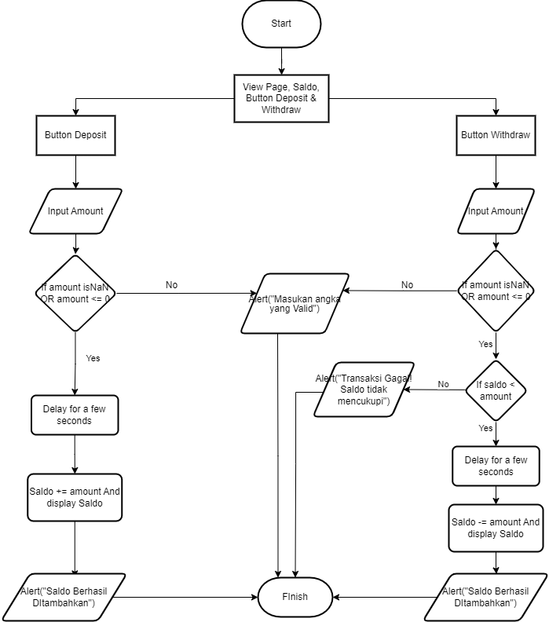

## Basic Banking System

Challenge 2 - MSIB (Binar Academy) - BACK END JAVASCRIPT - With AI Literacy & Global

## Skill Metric

- Programming Algorithm
- Melakukan error handling
- Menerapkan Asynchronous process
- Menerapkan OOP
- Menggunakan Git

## Delivery

1. Membuat repositori baru di GitHub dengan nama "Basic-Banking-System"
2. Salin file bank_account.js Challenge 1 ke direktori proyek di repositori baru
3. Membuat file JavaScript baru dengan nama banking_system.js
4. Implementasikan kelas BankAccount dengan metode deposit() dan withdraw()
5. Gunakan setTimeout() untuk mensimulasikan operasi transaksi yang asynchronous
6. Commit dan push perubahan ke repositori GitHub

## Criteria

1. Menggunakan modular class OOP (40 points)
2. Mengurai proses berpikir dengan menggunakan flowchart (30 points)
3. Menggunakan GitHub untuk mengelola repository (30 points)

## Langkah Pengerjaan

- Buatlah repositori baru di GitHub dengan nama
  **Basic-Banking-System**.
- Salin file **bank_account.js dari Challenge 1** ke direktori proyek di repositori baru tersebut. File ini akan berisi definisi kelas **BankAccount** yang akan digunakan dalam implementasi sistem perbankan.
- Buatlah file JavaScript baru dengan nama **banking_system**.js. File ini akan menjadi pusat implementasi sistem perbankan menggunakan konsep **OOP**.
- Implementasikan kelas BankAccount dengan minimal dua metode:
  - **deposit(amount)**: Metode ini akan menerima jumlah uang yang akan disimpan ke dalam akun.
  - **withdraw(amount)**: Metode ini akan menerima jumlah uang yang akan ditarik dari akun, asalkan saldo mencukupi.
- Gunakan fungsi **setTimeout()** untuk mensimulasikan operasi transaksi yang **asynchronous**. Misalnya, setelah melakukan deposit atau withdrawal, Anda dapat menunda eksekusi selama beberapa detik sebelum mengembalikan hasil operasi.
- Lakukan commit dan push perubahan yang telah Anda buat ke **repositori** GitHub.

## Flowchart

